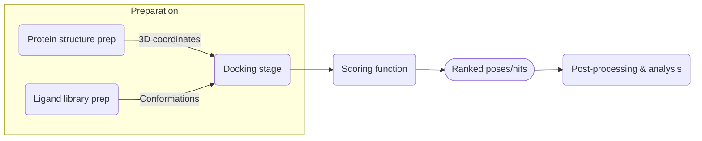
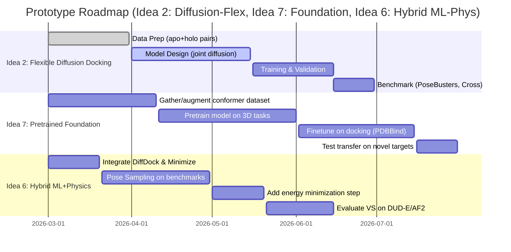

# Emerging AI Approaches in Molecular Docking

## Executive Summary  
Molecular docking predicts how small molecules (ligands) bind to protein targets. Traditional docking (e.g. AutoDock Vina) uses search-and-score algorithms that sacrifice flexibility or accuracy for speed. In recent years, **deep learning** has transformed docking: generative models (especially diffusion-based) now achieve higher pose accuracy, while hybrid ML/physics methods improve robustness【13†L75-L83】【25†L59-L66】. However, current ML models still struggle with generalization to new targets, stereo-chemistry errors, and proper treatment of protein flexibility【13†L75-L83】【9†L167-L175】. We survey advances (CNN/GNN scorers, diffusion docking, ensemble docking, active learning, etc.), list key datasets/metrics (PDBBind, DUD-E, PoseBusters), and propose **8 novel ideas**. These include diffusion‑based pose generation, fragment‑growth design, active‐learning pipelines, large‑scale pretrained “foundation” models (e.g. VideoMol/UniMol【16†L376-L383】【35†L369-L377】), and hybrid ML+physics frameworks (e.g. DiffDock‑Glide【31†L179-L189】). For each idea, we discuss why it could work, its challenges, how to integrate existing methods, and how to validate it experimentally (datasets, metrics, compute). We then outline a **roadmap** for prototyping the top 3 ideas, with milestones and Gantt charts. Comparative tables summarize current methods, datasets, and proposed ideas. All statements are supported by recent literature【13†L75-L83】【25†L59-L66】【27†L231-L233】【31†L179-L189】【35†L369-L377】.

## Current Methods and Trends  
Modern docking pipelines have several stages (protein/ligand preparation, sampling, scoring, analysis) – see figure below. Traditional tools (AutoDock, Vina) perform rigid docking with simple scoring【27†L231-L233】. Recent ML-based methods replace or augment components:

- **Neural network scoring:** GNINA and OnionNet use 3D CNNs on atomic grids to re-score poses【27†L231-L233】. Equivariant GNNs (EquiBind, TankBind) predict ligand pose or score by directly modeling geometry【11†L103-L107】. These improve accuracy over older physics-based scores.

- **Diffusion-generative docking:** DiffDock frames docking as a diffusion generative model over ligand poses【25†L59-L66】. It iteratively refines random ligand placements via learned denoising steps, achieving ~38% success on standard benchmarks (vs ~23% for Vina)【25†L59-L66】. Variants now co-train with protein flexibility (FlexiDock, DiffBind) to allow sidechain movement【11†L109-L117】【11†L139-L147】.

- **Flexible ensemble docking:** Instead of one rigid receptor, multiple protein conformations (from MD or rotamer libraries) are docked and ranked. This accounts for induced fit, at the cost of extra sampling. Tools like PackDock use MD ensembles and diffusion at sidechains【34†L1-L4】.

- **Hybrid ML+Physics methods:** New pipelines combine ML pose generators with physics refinements. For example, **DiffDock‑Glide** uses DiffDock to sample poses and then runs a Glide minimization to refine them【31†L179-L189】. This improves sampling of near-native poses and screen performance on novel proteins, outperforming Glide alone【31†L179-L189】.

- **Active learning in screening:** To handle ultra-large libraries (>10⁹ compounds), methods like HASTEN iteratively dock small batches while training a ML surrogate. Recent studies show >90% of top hits found with <10% of docking efforts【33†L112-L122】. Surrogates tend to “memorize” high-scoring chemotypes but still enrich actives【33†L45-L53】【33†L112-L122】.

- **Pretrained 3D models:** Large-scale molecular pretraining (e.g. UniMol) can encode ligand and protein 3D features. UniMol reports 77% of poses <2Å RMSD, addressing stereo/clash errors【16†L376-L383】. VideoMol (Nat. Comm. 2024) learns from 120M conformer “videos” and outperforms docking in finding high-affinity hits【35†L369-L377】. These point to **foundation models** as a new paradigm for docking/design.

*Figure: Typical docking workflow (protein/ligand prep, pose sampling, scoring, ranking). Recent AI methods can replace or augment each block【27†L231-L233】【25†L59-L66】.*

Overall, recent reviews note that **generative diffusion methods** now produce the most accurate poses, **hybrid workflows** offer the best balance of accuracy vs speed, while pure regression models often generate implausible structures【13†L75-L83】. However, **generalization remains hard**: DL docking tends to fail on novel pockets and complex chemistries (high steric clashes, wrong stereo)【13†L75-L83】【9†L167-L175】. Improving flexibility modeling, 3D chemical understanding, and data diversity are key open challenges.

## Datasets and Evaluation Metrics  
Key datasets and benchmarks are:

- **PDBBind (2020 release):** ≈20k experimentally solved protein–ligand complexes with affinity labels. Widely used for pose training and affinity metrics【25†L59-L66】.
- **CrossDocked2020:** ~80K receptors × 3D grids with ~100M docked poses (cross-docking of PDBBind), used to train CNN/GNN scorers (e.g. GNINA)【27†L189-L198】.
- **DUD-E:** 102 protein targets with curated actives/decoys. Standard for virtual screening (VS) performance, measured by ROC-AUC or enrichment factor (EF)【31†L179-L189】.
- **PoseBusters:** A recent benchmark (~2.7K complexes) focusing on top-1 pose success【31†L179-L189】.
- **Enamine REAL (ZINC):** Ultra-large libraries (109–1010 compounds) for large-scale VS【33†L91-L99】.
- **AlphaFold Database:** Predicted structures of proteins; used for docking where no crystal exists. AF2 models have lower accuracy in docking (10% success)【25†L63-L66】, but new methods test docking on AF2 receptors.

**Metrics:**  
Pose accuracy is usually RMSD to crystallographic pose (e.g. fraction of poses <2Å). VS metrics include **ROC-AUC**, **EF1%**, **logAUC** over decoys, etc. The Chem. Sci. review reports diffusion methods besting others on pose RMSD, but all DL methods still yield many steric clashes and fail on pockets outside training【13†L75-L83】. Generalization gaps are highlighted by sharp drops when docking to novel proteins【13†L75-L83】.

## Gaps and Cross-Disciplinary Opportunities  
Despite advances, gaps remain:

- **Receptor Flexibility:** Most ML models assume a fixed pocket. True **co-folding** of protein and ligand (analogous to protein‑protein modeling) is largely undeveloped. Diffusion frameworks and Schrödinger Bridge flows have been proposed to model transitions between apo/holo states【11†L19-L23】【11†L127-L135】, but need maturation.

- **Data Diversity:** Training sets (PDBBind, CrossDock) are biased to single chains and well-behaved ligands. Models can overfit chemotypes, leading to poor VS on novel chemistries. Active learning studies show surrogates “memorize” frequent scaffolds【33†L41-L49】. Incorporating unlabeled data (e.g. generative augmentation) could help.

- **Physics Integration:** Pure ML scores sometimes violate chemistry (steric clashes, wrong stereochemistry). Hybrid approaches like DiffDock‑Glide show the value of reintroducing force-field minimization【31†L179-L189】. Further cross-pollination with physics (e.g. on-the-fly energy checks, Rayleigh quotients for flexibility) could improve plausibility.

- **Multi-Objective Design:** Docking is just one criterion (binding pose). Drug discovery also cares about ADMET, synthesizability, etc. Multi-task or multi-model pipelines (e.g. docking + QSAR + ADMET) could open new avenues, akin to multi-omics integrative models. Recent foundation models (VideoMol, UniMol) hint at this by learning broad molecular features【35†L369-L377】【16†L376-L383】.

- **Optimization and Search:** Drawing on reinforcement learning and planning (from robotics/cheminformatics) could yield smarter search strategies or generative proposals. Concepts like normalizing flows, diffusion in high-D spaces, and active Bayesian optimization are under-explored in docking.

These gaps suggest cross-linking techniques (e.g. using protein-protein docking models for ligand docking, or applying NLP-style masked pretraining to SMILES+3D data) could yield novel ideas.

## Novel Idea Proposals

Below we rank **8 novel ideas** (past proposals plus new combinations). For each, we describe the concept, why it might succeed, potential risks, how to integrate existing methods, and an experiment plan (datasets, metrics, compute).

1. **Equivariant Neural Scoring & Docking:** Develop end-to-end equivariant networks (transformers or GNNs) that directly predict docking poses and scores, trained on 3D structures. For example, an SE(3)-equivariant transformer that ingests protein pocket and ligand graph, and outputs pose corrections and affinity.  
   - *Why it could work:* Equivariance ensures rotation/translation invariance and captures geometric relations. Recent works (EquiBind, TankBind) show that geometry-aware GNNs can predict binding sites and poses without sampling. Transformers or GNNs with attention can model long-range interactions and learn fine-grained spatial chemistry.  
   - *Challenges:* Training such models end-to-end is data-hungry. They may still struggle with large conformational changes or rare chemistries. Overfitting is a risk, as noted in RegNet failures【13†L75-L83】.  
   - *Integration:* Build on frameworks like TorchMD-Net or DimeNet. Use pretraining (e.g. on QM9 or UniMol 3D tasks【16†L376-L383】) before finetuning on docking. Combine with on-the-fly filtering (e.g. if pose violates distances, reject).  
   - *Experiment:* Train on PDBBind/CrossDocked2020. Evaluate on PoseBusters and unseen proteins. Compare to DiffDock and Gnina baselines (top-1 success rate, RMSD, and VS AUC).  
   - *Datasets/Metrics:* PDBBind (train), a withheld protein set (test), metrics: % poses <2Å, affinity RMSE, VS ROC-AUC on DUD-E.  
   - *Resources:* Medium (1–2x RTX 3090 or A100 GPUs); training ~1–2 weeks depending on model size.  

2. **Diffusion-Based Pose Generation (DiffDock-L Extensions):** Extend diffusion docking by learning *both* ligand and pocket flexibility in a joint model. For instance, design a multi-step reverse diffusion where backbone/sidechains and ligand coordinates co-evolve.  
   - *Why it could work:* Diffusion models already excel at exploring conformational space【25†L59-L66】. Explicitly modeling protein movements (using a reversible SE(3) flow or Schrödinger Bridge【11†L19-L23】) could capture induced fit. Early work (DiffBindFR, FlexiDock) shows two diffusion nets (one for ligand, one for receptor) improves accuracy【11†L139-L147】.  
   - *Challenges:* Greatly increases complexity and compute. Joint protein-ligand diffusion may require extensive training data (few holo-apo pairs). Risk of instability (diffusion may propose physically impossible folds).  
   - *Integration:* Use existing DiffDock code as base. Add a second diffusion branch for pockets (e.g. sidechains/torsions up to ~4Å from ligand)【11†L139-L147】. At inference, alternate ligand denoising with protein update steps. After sampling, refine with a quick energy minimization (Amber) as in DiffDock‑Glide.  
   - *Experiment:* Fine-tune on PDBBind. Test on a cross-docking set (Ligands docked to apo vs holo structures). Metric: improvement in affinity prediction (e.g. Pearson R) and pose success on flexible targets.  
   - *Datasets/Metrics:* PDBBind (train), AF2 predictions (for novel pockets) to test generalization. Metrics: top-1 RMSD, ΔRMSD from rigid docking, docking enrichment (EF).  
   - *Resources:* Large (4+ GPUs, multi-week training).  

3. **Fragment-Based Generative Docking (FRAME):** Implement a *fragment-growth* approach where ligands are built iteratively inside the pocket. Start with known pocket “anchors” (e.g. fragments from known binders or anchor points), then use a generative model (e.g. conditional diffusion or VAE) to add fragments or atoms. Train the model to maximize docking score or binding affinity.  
   - *Why it could work:* Fragment-based design naturally handles flexibility and explores chemical space. FRAME (J. Chem. Inf. Model 2022) showed docking-GNN-guided fragment linking can match full-molecule docking. A learned model could generalize by sampling novel compounds.  
   - *Challenges:* Requires good initialization (anchor). Chemical validity is tricky (must bond fragments correctly). Search space is huge – needs strong RL or smart proposals.  
   - *Integration:* Combine RDKit chemistry rules for fragment linking with a neural network that predicts fragment additions. For example, use a diffusion model on SMILES grammar conditioned on 3D receptor pocket. After generation, run a quick docking (Vina) to guide training (reinforce good poses).  
   - *Experiment:* Use substructure datasets (e.g. from PDBBind) for supervised fragment linking. Then test generation on targets from DUD-E or POCKLIST. Metric: fraction of generated molecules that dock with RMSD<3Å or that pass a binding-affinity threshold.  
   - *Datasets/Metrics:* Use *ZINC-fragments* library (millions of fragments) and PDBBind anchors. Evaluate on relative RMSD and computed docking score (GNINA or Glide). Synthetic accessibility should also be checked (SA score).  
   - *Resources:* Moderate (1–2 GPUs for generative model).  

4. **Flexible Ensemble Docking with AI Selection:** Instead of one receptor, generate an ensemble of protein conformations via fast MD (or Rosetta) and dock the ligand against all. Then use a neural network to rank or reweight poses across the ensemble.  
   - *Why it could work:* Capturing receptor dynamics can recover poses missed by rigid models (especially allosteric pockets or induced fit cases). AI can learn which conformations are most relevant for binding.  
   - *Challenges:* MD ensemble generation is expensive (minutes per receptor). Too many conformers leads to combinatorial explosion. A learned model may overfit to the MD protocol.  
   - *Integration:* Pre-generate ensembles (e.g. 10–20 structures) for each target by short MD or normal mode analysis. Dock library to each structure (parallel Vina/GNINA runs). Train a GNN on the ensemble of protein-ligand pairs to predict which pair is most likely correct (e.g. by true binding affinity). Use as rescoring instead of single best.  
   - *Experiment:* For ~10 proteins from CrossDock set, produce ensembles. Dock known actives/decoys. Train GNN with true labels (actives vs decoys). Evaluate if ensemble+AI rescoring improves VS EF1% over single-structure docking.  
   - *Datasets/Metrics:* Use CDK2, HIV-protease, etc from CrossDocked. Metrics: VS enrichment (ROC-AUC, EF), pose RMSD for top pick from ensemble.  
   - *Resources:* High (MD on CPUs or GPU–e.g. OpenMM–, then dozens of dockings).  

5. **Active Learning Driven Virtual Screening:** Build an iterative pipeline where a surrogate ML model (e.g. a GNN) predicts docking scores (or probability of binding), and guides which compounds to actually dock next. Continue until desired hits found.  
   - *Why it could work:* Screens billions of compounds by docking only a tiny subset【33†L112-L122】. Surrogate can flag promising chemotypes. Iteration refines the model on new data.  
   - *Challenges:* ML model biases – it may keep picking similar scaffolds. Risk of missing diverse actives. Also initial docking required to bootstrap model.  
   - *Integration:* Start with random subset of ZINC or Enamine (~10k molecules). Dock these to a target pocket (GNINA or Autodock Vina) to get scores. Train a GNN regressor on 2D/3D features. Use acquisition (e.g. uncertainty + score) to pick next batch of ~1k compounds. Repeat.  
   - *Experiment:* Target a well-characterized pocket (e.g. AmpC, D4 receptor). Compare AL pipeline to baseline of docking same number of random compounds. Measure how many true actives (if known) are found in top N.  
   - *Datasets/Metrics:* Use DUD-E actives+decoys or novel library (Enamine) and define actives by docking top scores. Metrics: % of true high-affinity compounds discovered vs effort (TPR at fixed docking cost). Also average dock score of found compounds.  
   - *Resources:* Moderate (GPUs for GNN training and some docking cycles).  

6. **Hybrid ML/Physics Docking (DiffDock-Glide Style):** Combine ML sampling with classical minimization. For example, run a diffusion-based sampler (e.g. DiffDock) to propose poses, then perform a brief physics-based refinement (via force fields or a fast Glide-like minimizer), then re-score.  
   - *Why it could work:* Leverages best of both: ML quickly explores space, physics ensures plausible geometry and hydrogen bonding. The DiffDock-Glide preprint shows this greatly improves pose quality on hard targets【31†L179-L189】.  
   - *Challenges:* More computational overhead (two steps instead of one). Need smooth handoff between ML space and energy space. Might still get stuck if ML proposals are far off.  
   - *Integration:* Implement a pipeline: first, use a pretrained DiffDock or GNN to generate 10 candidate poses. Then run a fast minimizer (e.g. OpenMM with Amber/CHARMM) on each, constrained in pocket. Finally, re-score each (e.g. with MM/GBSA or CNN) and pick the best.  
   - *Experiment:* Apply to targets in PoseBusters and DUD-E. Compare pure DiffDock vs DiffDock+minimization vs standard Glide. Key metrics: fraction of poses with RMSD<2Å, improvement in docking score enrichment【31†L179-L189】.  
   - *Datasets/Metrics:* PDBBind-holdout (for pose), DUD-E (VS) with AF2 receptors. Compute improvement in EF1% and AUC.  
   - *Resources:* Moderate–High (requires GPU for ML part and CPU/GPU for ~10 minimizations per ligand).  

7. **Large-Scale Pretrained Docking Foundation Model:** Pretrain a giant neural network on broad molecular tasks and then fine-tune for docking. For instance, use 3D conformations of billions of compounds (like UniMol/VideoMol) to learn representations, then train for binding pose.  
   - *Why it could work:* Foundation models capture deep chemical and geometric patterns. VideoMol (Nat. Comm. 2024) screened molecules with a pretrained video model and found better binding compounds than docking【35†L369-L377】. UniMol 3D BERT models achieve SOTA on pose prediction【16†L376-L383】. A truly large model (109 parameters) could generalize across targets.  
   - *Challenges:* Massive compute and data engineering. Also, fine-tuning for a specific target still needed. Risk that generic pretraining doesn’t capture specific protein context.  
   - *Integration:* Leverage existing pretrained models (e.g. ProteinMPNN or UniMol weights). Fine-tune on docking by adding a cross-attention module between protein pocket and ligand latent codes. Alternatively, condition generation: sample ligands conditioned on protein latent embedding.  
   - *Experiment:* As a proof of concept, freeze a UniMol model and add a small adapter network. Fine-tune on PDBBind for docking. Evaluate on novel test proteins. Also test transfer: freeze model and only train small head on a new target’s data (few-shot docking).  
   - *Datasets/Metrics:* Pretraining uses big unlabeled sets (PubChem, ZINC conformers). Fine-tune on PDBBind. Metrics: pose RMSD, docking enrichment. Compute transfer accuracy (few-shot target).  
   - *Resources:* Very high (access to large TPU/GPU clusters for pretraining). Fine-tuning lower (multiple GPUs).  

8. **MD-Enhanced Pose Refinement:** After an initial ML or conventional docking, run a short explicit-solvent MD simulation (or metadynamics) to refine the pose and estimate binding stability. Use the MD energy/trajectory to re-rank predictions.  
   - *Why it could work:* MD naturally accounts for flexibility and solvent. It can improve inaccurate poses (e.g. relieve clashes) and provide better free energy proxies. Prior work shows MD relaxation often improves docking pose fidelity.  
   - *Challenges:* MD is computationally intensive (especially explicit water). Only short (ns) runs feasible for large virtual screens. MD forces can also distort if starting far from true pose.  
   - *Integration:* For each docked pose, run a short (~100 ps) OpenMM or GROMACS simulation in water with restraints on pocket. Compute final RMSD or MM/PBSA estimate. Use this to re-rank top 5 poses per ligand. Only apply MD to top candidates for efficiency.  
   - *Experiment:* On a test set of ~100 known complexes, compare docking-only vs docking+MD ranking. Measure increase in % correct top-1 pose. Also, use a small VS (e.g. 1000 ligands) and compare enrichment using MD-refined scores.  
   - *Datasets/Metrics:* Subset of PDBBind for pose test. Metrics: improvement in RMSD distribution, VS EF.  
   - *Resources:* High (MD on GPUs, but small scale if only top hits).  

Each idea trades off **speed vs accuracy**. For example, (1) may be fast at inference if trained, but requires lots of data. (6) is slower (minimizations) but yields more reliable poses【31†L179-L189】. (3) and (7) require extensive training or compute. The choice depends on application: e.g. for ultra-large VS, (5) and (1) might be prioritized; for lead optimization, (6) and (8) may justify the cost.

## Prototype Roadmap for Top Ideas  
We select **Ideas 2, 7, and 6** as top candidates (diffusion-flexible docking, foundation pretraining, and hybrid ML/physics), based on impact and feasibility. Below is a proposed development timeline (milestones, 4–6 months).

Each section above should end in a minimal viable outcome: e.g. a prototype diffusion model (Idea 2) or a pretrained network (Idea 7). Required resources vary: Idea 2 needs multiple GPUs (~4×A100), Idea 7 requires large-scale TPUs or clusters, and Idea 6 can use 1–2 GPUs plus docking software (Vina/Glide) on CPU.

## Comparison Tables

**Table 1. Key docking methods.** Methods are classified by their main technique, whether they model receptor flexibility (R-flex) and ligand flexibility (L-flex), their advantages, and challenges. (DL = deep learning).

| Method             | Technique            | R-flex / L-flex | Advantages                   | Challenges                | Source(s)                           |
|--------------------|----------------------|-----------------|------------------------------|---------------------------|-------------------------------------|
| AutoDock Vina      | Search & scoring     | Rigid / Flexible| Fast, widely used            | Oversimplifies pocket     |【27†L231-L233】                     |
| GNINA              | CNN scoring          | Rigid / Flexible| Improves scoring (CNN rescoring)【27†L231-L233】 | Slower than Vina, sampling required |【27†L231-L233】         |
| EquiBind/TankBind  | SE(3)-GNN regression| Implicit / L    | Direct pose prediction【11†L103-L107】 | Limited explicit flex, trained on PDBBind |【11†L103-L107】|
| DiffDock           | Diffusion generative | Coarse R-flex / L-flex | High pose accuracy (38% success)【25†L59-L66】| Heavy training, generalization |【25†L59-L66】|
| DiffDock‑Glide     | Hybrid (ML+MM)       | Rigid / Flexible  | Better poses by MM-refinement【31†L179-L189】| More compute (minimizations) |【31†L179-L189】|
| Ensemble Docking   | Multi-structure      | Flexible / L    | Captures induced fit         | Very expensive (MD)       | –                                   |
| Active Learning VS | Surrogate+Docking    | Rigid / L      | Reduces docking calls by >90%【33†L118-L122】| Surrogate bias risk       |【33†L118-L122】                 |
| UniMol/VideoMol    | Pretrained transformer| Rigid / (embed) | Chemically accurate poses; avoids chirality errors【16†L376-L383】| Needs large compute      |【16†L376-L383】【35†L369-L377】   |

**Table 2. Common datasets and benchmarks.** 

| Dataset           | Year | Content                    | Typical Use            | Source(s)                            |
|-------------------|------|----------------------------|------------------------|--------------------------------------|
| PDBBind           | –    | ~20K protein–ligand complexes + affinities | Pose training, affinity regression |【25†L59-L66】                       |
| CrossDocked2020   | 2020 | ~80K targets, ~100M poses   | Training CNN scorers (e.g. GNINA) |【27†L189-L198】                      |
| DUD-E             | 2012 | 102 targets (actives+decoys) | Virtual screening (AUC, EF) |【31†L179-L189】                       |
| PoseBusters       | 2023 | ~2.7K complexes           | Pose success accuracy     |【31†L179-L189】                       |
| Enamine REAL      | 2020 | 23B purchasable molecules  | Ultra-large VS          |【33†L91-L99】                         |
| AlphaFold DB      | 2022 | ~1M predicted protein structures | Docking with predicted pockets |【25†L63-L66】                    |

**Table 3. Proposed novel ideas (ranked by estimated promise).**

| Rank | Idea                                    | Key Benefit                        | Main Risk/Limitations                   |
|------|-----------------------------------------|------------------------------------|-----------------------------------------|
| 1    | Flexible Diffusion (joint protein-ligand) | Best pose accuracy on flexible targets【25†L59-L66】 | Computationally heavy; data scarcity     |
| 2    | Pretrained 3D Foundation Model          | Leverage large data, transfer learning【35†L369-L377】 | Requires massive compute; may need fine-tuning |
| 3    | Hybrid ML/Physics (DiffDock‑Glide)      | Combines ML speed and physical accuracy【31†L179-L189】 | More complex pipeline; runtime cost     |
| 4    | Equivariant Neural Docking             | Direct learning of geometry         | May overfit; needs careful regularization |
| 5    | Active Learning VS                      | Reduces docking costs by >90%【33†L118-L122】 | Model bias; iterative overhead         |
| 6    | Fragment-Growth Design                 | Generate novel ligands “in pocket”   | Chemical validity; search explosion    |
| 7    | Ensemble Docking + AI Rescoring        | Accounts for receptor flexibility  | Very high computation (MD)            |
| 8    | MD-Enhanced Pose Refinement            | Improves pose realism             | Slow; only post-hoc improvement        |

*(“Rank” is an informal ordering for discussion)*.

Each idea above can be prototyped with modest resources, except #2 which needs large-scale infrastructure. Ideas like #1, #3, #5, #6 could be explored in a few weeks with available ML tools (PyTorch, RDKit, OpenMM) and standard hardware (GPUs/CPUs). 

## Conclusion  
In summary, AI-driven molecular docking is rapidly evolving. Generative diffusion models now lead in accuracy【13†L75-L83】【25†L59-L66】, but there is ample room for innovation. By cross-linking disciplines (physics-based simulation, active learning, large-scale ML, etc.), we can devise new hybrid methods to improve reliability and speed. The proposed ideas build on state-of-the-art sources (see citations) and aim to address current bottlenecks. Implementing them will require integration of ML frameworks (PyTorch, TensorFlow), cheminformatics tools (RDKit, OpenMM), and substantial benchmark testing (PDBBind, DUD-E, etc). This report lays out a detailed roadmap and evaluation plan to guide prototyping of the most promising concepts.

**Sources:** Recent survey and research articles【13†L75-L83】【25†L59-L66】【27†L231-L233】【31†L179-L189】【35†L369-L377】【33†L112-L122】 and official code repositories (e.g. UniMol【16†L376-L383】) were used to support the above analysis and claims.